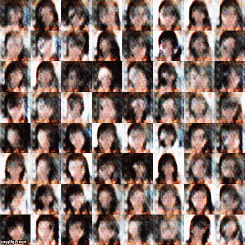
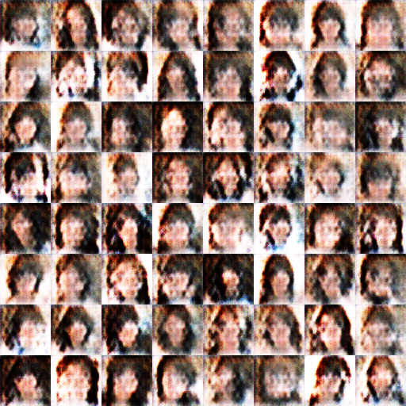
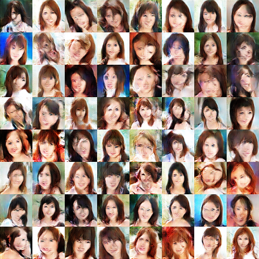
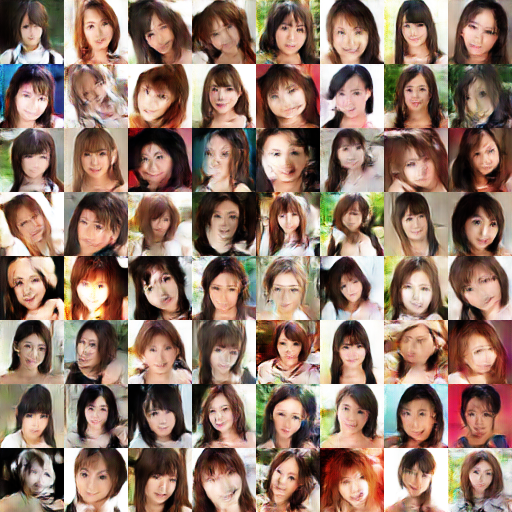

# Use DCGAN in Tensorflow to generate Japanese Actress Faces

In the summer of 2018, I learned about GAN and found this interesting project [Neural Face](https://carpedm20.github.io/faces/) that can generate face images using [Deep Convolutional Generative Adversarial Networks](http://arxiv.org/pdf/1511.06434v2.pdf)(DCGAN). I wanted to make use of it to do something fun and then I finished this Japanese actress(adult video actresses actually ˋ( ° ▽、° ) ) faces generation project. 

## Dataset

I found a database called *AV Idol Directory* that had a large amount of images of actresses and used BS4 to write a crawler *data/actressCrawler.py* to get the images. I got approximately 6000 images in total. In order to make the data a valid input, *data/reshape_imgs.py* is used to change the size of the images.

The dataset is not quite ideal because:

1. The number of images are not enough
2. Not all of the faces are in the same angle and size. I believe it can be improved by a face detector(but it is actually not done in this project).

## Result

After 5th epoch:

After 45th epoch:

After 90th epoch:

Then I stopped the program because my laptop had been burning for a whole day!